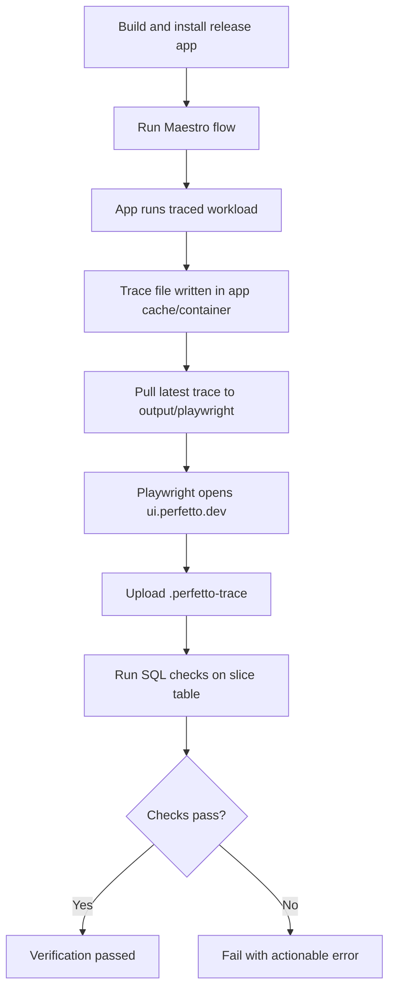
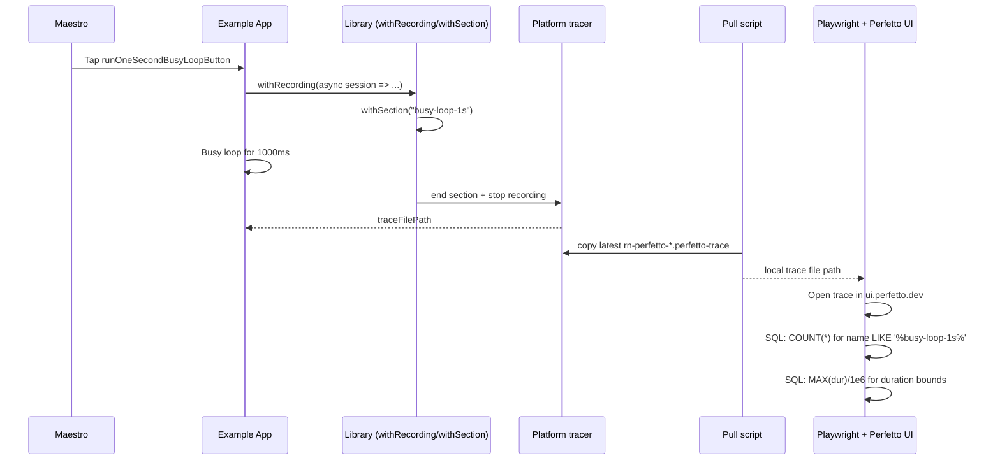
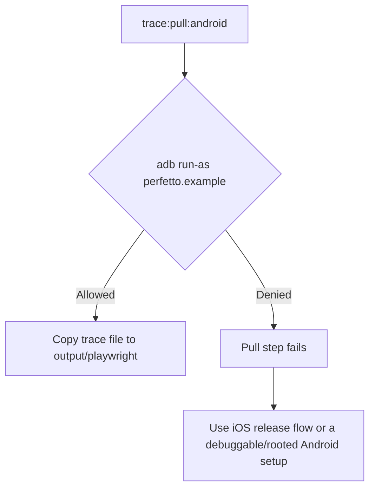

# Testing and Trace Verification Guide

This document describes the end-to-end process used in this repo to:

1. Trigger traceable work in the example app.
2. Capture a `.perfetto-trace` file.
3. Pull the trace locally.
4. Open it in Perfetto UI via Playwright.
5. Verify begin/end slices and (optionally) expected duration bounds.

## What is Verified

- Presence of completed slices created through begin/end semantics (`dur > 0` in Perfetto `slice` table).
- For the dedicated busy-loop test, duration of `busy-loop-1s` is validated between `900ms` and `1500ms`.
- For the WebView bridge test, `webview-demo-section` is emitted from inside `react-native-webview` and relayed through `createWebViewTraceBridge`.

## Test Artifacts

- App button: `runOneSecondBusyLoopButton` (`example/src/App.tsx`)
- Section name: `busy-loop-1s` (`example/src/App.tsx`)
- Maestro flow: `.maestro/capture-busy-loop-1s.yaml`
- WebView button: `runWebViewTracingDemoButton` (`example/src/App.tsx`)
- WebView section name: `webview-demo-section` (`example/src/App.tsx`)
- WebView Maestro flow: `.maestro/capture-webview-trace.yaml`
- Playwright verifier: `scripts/verify-trace-playwright.mjs`
- Trace pull scripts:
  - Android: `scripts/pull-latest-android-trace.sh`
  - iOS: `scripts/pull-latest-ios-trace.sh`
- Local trace output directory: `output/playwright/`

## End-to-End Flow



## Sequence of Capture and Verification



## Preconditions

1. Install dependencies:

```sh
yarn
```

2. Vendor Perfetto SDK files:

```sh
yarn vendor:perfetto-sdk
```

3. Install Maestro CLI:

```sh
yarn maestro:install
```

4. Have an emulator/simulator running and the example app installed as `perfetto.example`.

## iOS Release Verification (Recommended for Release Coverage)

1. Build/install release app:

```sh
cd example
npx react-native run-ios --mode Release --simulator "iPhone 16" --no-packager
cd ..
```

2. Capture 1s busy-loop trace:

```sh
yarn maestro:test:capture-busy-loop-1s
```

3. Pull latest iOS simulator trace:

```sh
yarn trace:pull:ios
```

4. Verify slice exists and duration is in bounds:

```sh
yarn playwright:test:verify-busy-loop-1s
```

Use headed browser mode if you want to watch the Perfetto UI actions:

```sh
yarn playwright:test:verify-busy-loop-1s -- --headed
```

Keep the browser open after verification for manual inspection:

```sh
yarn playwright:test:verify-busy-loop-1s -- --headed --keep-open
```

5. One-shot iOS command (runs verification in headed mode):

```sh
yarn maestro:test:capture-and-verify-busy-loop-1s:ios
```

## Android Release Verification

1. Build/install release app (example command):

```sh
cd example
npx react-native run-android --mode release --no-packager
cd ..
```

2. Capture 1s busy-loop trace:

```sh
yarn maestro:test:capture-busy-loop-1s
```

3. Pull latest Android trace:

```sh
yarn trace:pull:android
```

4. Verify with Playwright:

```sh
yarn playwright:test:verify-busy-loop-1s
```

5. One-shot Android command (runs verification in headed mode):

```sh
yarn maestro:test:capture-and-verify-busy-loop-1s
```

6. Capture and verify WebView bridge trace (Android):

```sh
yarn maestro:test:capture-and-verify-webview-trace
```

## Known Android Release Caveat

On many production-like Android environments (for example, Play Store system images), `run-as` is denied for non-debuggable release builds. The Android pull script relies on `adb shell run-as`, so trace extraction can fail even when capture itself succeeds.



## What the Playwright Verifier Checks

The verifier opens `https://ui.perfetto.dev`, uploads the trace, and runs SQL against `slice`.

For each `--event` substring:

1. Existence check:

```sql
SELECT COUNT(*) AS matching_sections
FROM slice
WHERE name LIKE '%<event-substring>%'
  AND dur > 0;
```

2. Optional duration check (when `--min-dur-ms` or `--max-dur-ms` is provided):

```sql
SELECT COALESCE(MAX(CAST(dur AS REAL) / 1000000.0), 0) AS max_duration_ms
FROM slice
WHERE name LIKE '%<event-substring>%'
  AND dur > 0;
```

## Useful Commands

- Default section verification (`withRecording-demo`):

```sh
yarn playwright:test:verify-trace
```

- Verify multiple events:

```sh
yarn playwright:test:verify-trace -- --event withRecording-demo --event manual-synthetic-work
```

- Verify WebView bridge section:

```sh
yarn playwright:test:verify-webview-trace
```

- Verify an explicit trace file:

```sh
yarn playwright:test:verify-busy-loop-1s -- --trace output/playwright/<file>.perfetto-trace
```

- Pull iOS trace for a specific simulator:

```sh
SIM_UDID=<simulator-udid> yarn trace:pull:ios
```
